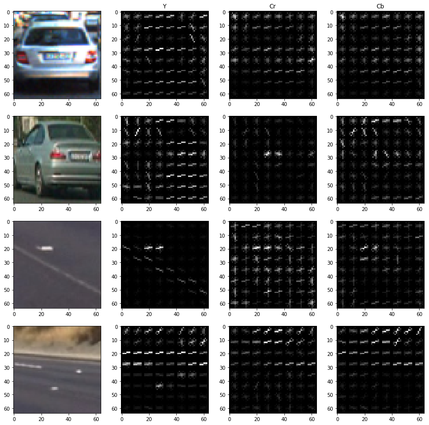
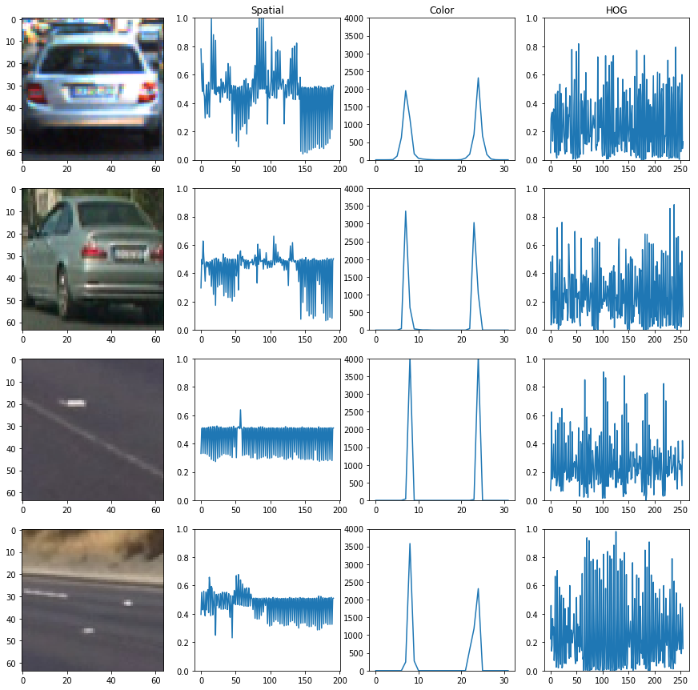
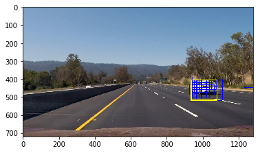
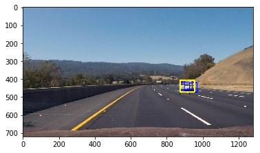
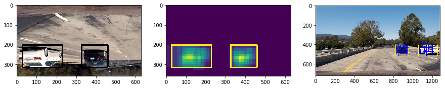

# **Vehicle Detection Project**

My project includes the following files:
* pipeline.ipynb - Jupyter notebook to process the original video
* lesson_functions.py - helper functions used by the pipeline. Most of them are from the lesson.
* video.mp4 - output video with vehicles marked with yellow boxes
* README.md - summarizing the results
* svc_c100.pkl - trained SVM model

The goals / steps of this project are the following:

* Extract features from the spatial binary, color histogram, histogram of oriented gradients (HOG) on a labeled training set of images and train a SVM classifier.
* Implement a sliding-window technique to search for vehicles in images.
* Build a pipeline to process the video stream to detect vehicles frame by frame.
* Estimate a bounding box for vehicles detected.

---
### Feature extraction

I use the training set ([vehicle](https://s3.amazonaws.com/udacity-sdc/Vehicle_Tracking/vehicles.zip) and [non-vehicle](https://s3.amazonaws.com/udacity-sdc/Vehicle_Tracking/non-vehicles.zip)) provided by the [project](https://github.com/udacity/CarND-Vehicle-Detection)  to train my SVM classifier. I choose `sklearn.svm.svc()` with RBF kernel because the test score is better than the one with the linear kernel. I extract spatial binary, color histogram, and HOG features using `extract_features()` function defined in `lesson_functions.py`. The combined features are normalized by `sklearn.preprocessing.StandardScaler()`. The whole training process is described in cell #2 of my notebook, which will produce a trained SVM classifier.  

Here are examples of HOG features in `Y`, `Cr` and `Cb` channels with (`orientation`, `pix_per_cell`, `cell_per_block`) set to (9, 8, 1).

I choose `YCrCb` color space because it preserves the color under varying illumination conditions ([this](http://www.learnopencv.com/color-spaces-in-opencv-cpp-python/) is a good article to read). I have tried `HSL` color space, which was used in [Project 4](https://github.com/enhsin/p4-advancedLaneLines) to dectect lane lines. It seems to give more false negatives when it applys to the video stream. 

Channels `Cr` and `Cb` don't appear to be useful to detect the shape of non-vehicle objects, so I only use Channel `Y` for the HOG feature in the final pipeline.

Here is the visualization of all the feature vectors with my final choice of parameters.

Here are the parameters I use.

|Spatial Parameter| Value |
|-----------------|-------|
|channel          |Y,Cr,Cb|
|spatial_size     |8      |

spatial feature size = 8x8x3 = 192

|Color Parameter  | Value |
|-----------------|-------|
|channel          |Cr,Cb  |
|hist_bins        |16     |

color feature size = 16x2 = 32

|HOG Parameter    | Value |
|-----------------|-------|
|channel          |Y      |
|orientation      |4      |
|pix_per_cell     |8      | 
|cell_per_block   |1      | 

HOG feature size = 4x(64/8)x(64/8) = 256

Total feature size = 480

`pix_per_cell` is set to 8 because the images in the training set are 64x64 in size and I want all the pixels to be used (no remainder). This will give 64 cells. `cell_per_block` is fixed at 1 because I prefer a smaller set of features to reduce the prediction time. I loop through various combinations of `orientation`, `hist_bins`, and `spatial_size` (cell #3). They all give an accuracy about 0.99. I select (`orientation`, `hist_bins`, `spatial_size`) = (4, 16, 8) because of the speed and performance. Some models will take 2-3 hours to process the whole video and the one I choose takes 23 minutes on the virtual machine of my windows laptop. ~~I really don't want my laptop to run for several hours in a 100F home without AC (recently moved to a new city).~~ 

### Sliding Window Search

I use the method taught in Session 35 (Hog Sub-sampling Window Search) to search for cars. The code is described in `lesson_functions.find_cars()`. `cells_per_step` is set to 2 (75% of overlapping) to increase the chance of detection and to use multiple detections to reject false positives. The advantage of this method is to extract HOG features once and to avoid the expensive repeating HOG calculation. I run this function at two scales (0.85, 1.8) to detect both near and far objects. A mask (defined in cell #6) is also used to focus on the right two lanes.

Here are examples of sliding window detections (blue boxes). There are two kinds of blue boxes, big and small (they are overlapping). The yellow boxes are the final detection. 

 

More examples of the detection on test images are shown in cell #8.

### Multiple detections

I apply the method in Session 37 (Multiple Detections & False Positives) to combine multiple detections and produce the bounding box of the detected vehicle. The code is at `lesson_functions.threshold_boxes()`. I create a heatmap from sliding window detections of a single frame and use `scipy.ndimage.measurements.label()` to label connected components. I use two thresholds, `thresh_hi`  and `thresh_lo` to reject false positives and to find the bounding box. The maximum count of a connected component (number of detection) must be equal or greater than `thresh_hi` to be considered as a real detection. The heatmap pixels with counts greater than `thresh_lo` are used to mark the final bounding box. I set `thresh_hi`= 4 and `thresh_lo` = 1. 

Here are the images of the raw input data (left), the heatmap of the sliding window detection (middle), and the final processed image (right). The bounding box is drawn with thick lines. The blue boxes are sliding window detections.

The input image has been cropped to focus on the region of interest and to reduce processing time. I flip the image so that features can be extracted starting from the lower right instead of the upper left. If the image is not flipped, there could be pixels on the right and on the bottom unanalyzed (depending on `scales`, `pix_per_cell`, `cell_per_block` or `cells_per_step`) and we want to detect cars entering into the frame early. 

### Video Implementation

The pipeline to process each frame of the project video is described in cell #7. Here is the output [video](./video.mp4). The yellow box is the final detection and blue boxes are sliding window detections. False positives are rejected by setting the proper `thresh_hi` (see above). I also set `class_weight` = {0:0.9, 1:0.1} (in `sklearn.svm.svc()`) to give non-vehicle samples more weights and to change the decision boundary a little bit.

---

### Discussion

* My model can't identify the car entering the frame when it sees a single front wheel (e.g., at t=5 and 27s). Including these types of images to the training set (and using more complicated models such as gradient boosting trees) should help the model detect the car early. 

* The bounding box is just a **rough** estimate of other vehicles’ positions. It doesn’t trace the contour line of the vehicle and the peak of the heatmap doesn't represent the center of the car. I think knowing exactly where the other cars are is very useful to avoid collisions. I guess techniques like Sobel could be used to detect the edge of the car.

* My pipeline can not distinguish two cars next to each other (t=35s) because I didn’t implement any mechanism to keep track of all the vehicles. If the number of detected vehicles is known, methods such as [spectral clustering](http://www.scipy-lectures.org/advanced/image_processing/#segmentation) can be used to segment the detections, which can give a more accurate estimate of the vehicle’ location.   
 
